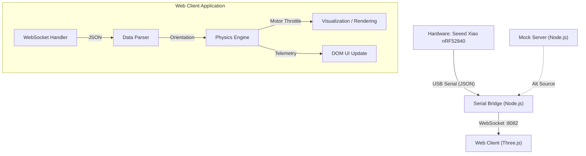

# Architecture Overview

## System Block Diagram

## Data Flow
1.  **Ingestion**: IMU data is streamed as JSON: `{"r": float, "p": float, "y": float}` via Serial (115200 baud).
2.  **Transport**: Node.js `serial_bridge.js` forwards frames to `ws://localhost:8082`.
3.  **Processing** (`app.js`):
    *   **Parsing**: JSON decode.
    *   **Normalization**: Clamping and coordinate mapping.
    *   **Physics Mixing**:
        *   `Throttle = Base (55%) +/- (Pitch * Gain) +/- (Roll * Gain)`
    *   **Rendering**: Three.js standard loop updates scene graph rotation and propeller animation state.

## Hardware Interfaces
*   **Input**: USB Serial (COM Port).
*   **Protocol**: JSON Lines.
*   **Coordinate System**:
    *   IMU: Euler Angles (Degrees).
    *   Viz: Three.js World Space (Y-Up).

## Timing Constraints
*   **Target Frame Rate**: 60 FPS (16.6ms).
*   **Data Rate**: ~100Hz from hardware.
*   **Latency**: < 50ms end-to-end desirable for real-time feel.
