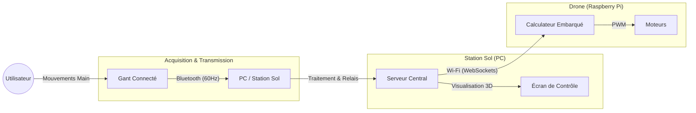

# Rapport Technique : Système de Contrôle de Drone par Interface Haptique (BLE-HAND-VIZ)

**Date** : 23 Janvier 2026
**Sujet** : Conception d'une architecture distribuée pour le pilotage de drone via Bluetooth Low Energy.

## 1. Introduction

Ce projet, intitulé **BLE-HAND-VIZ**, a pour objectif principal de développer une interface homme-machine (IHM) intuitive permettant de contrôler un drone à l'aide des mouvements naturels de la main. Contrairement aux radiocommandes traditionnelles basées sur des joysticks, ce système exploite une unité de mesure inertielle (IMU) fixée sur un gant pour traduire l'orientation de la main (Roulis, Tangage, Lacet) en commandes de vol.

Le système a été conçu pour être modulaire et distribué, séparant clairement la couche d'acquisition, la couche de traitement (Station Sol), et la couche d'exécution (Drone/Raspberry Pi), assurant ainsi robustesse et évolutivité.

## 2. Architecture du Système

L'architecture retenue est de type distribuée, s'articulant autour d'une "Station Sol" centrale (PC) qui fait le relais entre le dispositif de commande et le drone. Cette approche permet de contourner la faible portée du Bluetooth Low Energy (BLE) en utilisant le Wi-Fi pour la communication longue distance vers le drone.

### Schéma Fonctionnel

Le flux de données suit une logique pipeline stricte :
1.  **Acquisition** : Le gant capture l'orientation à haute fréquence.
2.  **Pont Local** : La station sol reçoit ces données brutes via Bluetooth.
3.  **Distribution** : Un serveur central (Hub) redistribue ces commandes en temps réel via le réseau Wi-Fi.
4.  **Exécution** : Le drone reçoit les ordres et ajuste la vitesse de ses moteurs.

## 3. Analyse Technique Détaillée

### 3.1. Le Module d'Acquisition (Gant Connecté)
La partie matérielle repose sur un microcontrôleur **Seeed XIAO nRF52840 Sense**. Ce composant a été choisi pour sa taille réduite et son intégration native du Bluetooth et d'une IMU (LSM6DS3). 

Le firmware, développé en C++, implémente un **filtre complémentaire** (`Alpha = 0.98`) pour fusionner les données de l'accéléromètre et du gyroscope. Ce filtrage est essentiel pour éliminer le bruit du gyroscope et les accélérations parasites. De plus, un algorithme de calibration dynamique a été intégré pour corriger la dérive du lacet (Yaw drift) lorsque le capteur est détecté comme immobile. Les données sont transmises sous forme de paquets binaires optimisés de 24 octets à une fréquence de 60 Hz, garantissant une latence minimale.

### 3.2. La Station de Contrôle (Pont et Serveur)
La station sol, hébergée sur un PC, exécute deux processus critiques :
*   **Le Pont BLE (Python)** : Ce script assure l'interface matérielle avec le gant. Il gère la connexion Bluetooth, décode les paquets binaires et les convertit en format JSON standardisé.
*   **Le Hub (Node.js)** : Agissant comme tour de contrôle, ce serveur WebSocket écoute sur le port 8082. Il reçoit les données du pont et les diffuse instantanément à tous les clients connectés (Drone et Interface de visualisation). Cette architecture "Publisher-Subscriber" permet de découpler totalement la source de commande des récepteurs.

### 3.3. Le Drone (Raspberry Pi)
Le "cerveau" embarqué du drone est un Raspberry Pi exécutant un client Python. Ce programme se connecte au Hub via le réseau Wi-Fi et écoute les paquets de télémétrie. À chaque réception, il applique une matrice de mixage (Quad-X Mixing) pour convertir les angles d'orientation (Roll/Pitch/Yaw) en pourcentages de puissance pour les quatre moteurs.

### 3.4. Interface de Simulation
Afin de valider les algorithmes de vol sans risquer le matériel physique, une simulation 3D a été développée. Hébergée localement, cette page web utilise la bibliothèque **Three.js** pour rendre un modèle physique du drone. Elle se connecte au même Hub que le vrai drone, permettant de visualiser exactement ce que le drone "comprend" des mouvements de l'utilisateur.

## 4. Conclusion

Le projet BLE-HAND-VIZ démontre la faisabilité d'un contrôle de drone intuitif et réactif basé sur les gestes. L'architecture distribuée mise en place offre une sécurité accrue grâce au relais Wi-Fi et une grande flexibilité pour le développement futur, permettant d'ajouter des fonctionnalités comme le retour vidéo ou des capteurs d'évitement d'obstacles sans modifier la structure fondamentale du système.
